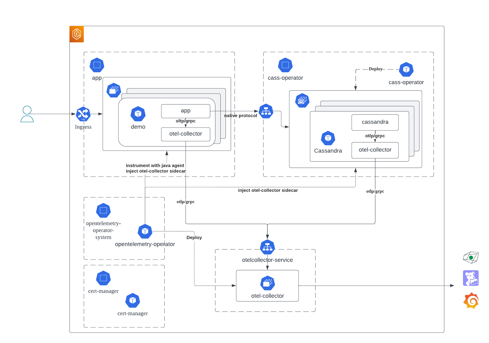
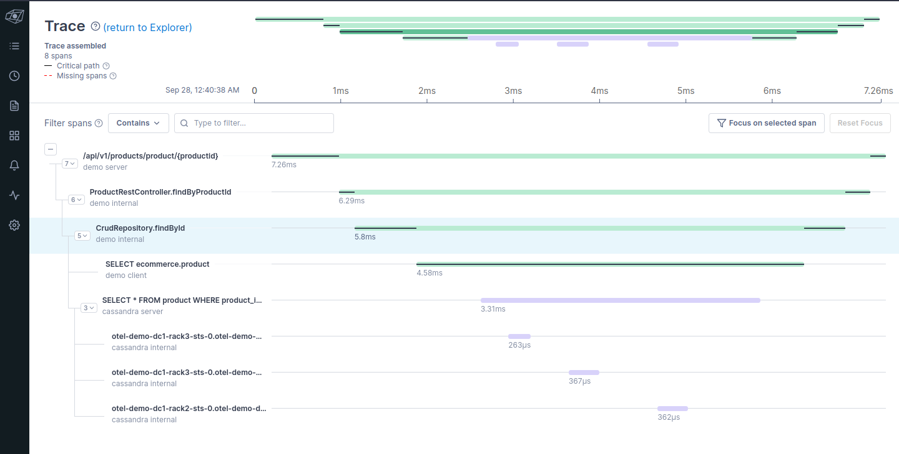

# cassandra-opentelemetry-demo

The repository for Apache Cassandra OpenTelemetry integration demo.

* `cassandra/`
    * Dockerfile to build Apache Cassandra container image with OpenTelemetry integration from https://github.com/yukim/cassandra `otel` branch.
* `k8s/`
    * Resource definitions for the demo
* `management-api-for-cassandra/`
    * Dockerfile to build container image from https://github.com/k8ssandra/management-api-for-apache-cassandra to include Apache Cassandra with OpenTelemetry integration.

# Tested demo environment

* AWS EKS deployed on us-east-1 region
    * 6 x t3.xlarge (4 vCPU / 16GiB mem) across 3 AZ
        * 3 nodes dedicated for Cassandra
        * other 3 nodes for apps / opentelemetry collector

The demo environment can be created in ap-northeast-1 region with eksctl:

```
eksctl create cluster -f eks/cluster.yaml
```

# Run demo on Kubernetes

## Demo architecture



## 1. Install cert-manager

[cert-manager](https://cert-manager.io/) is used by OpenTelemetry operator.

In this demo, we use the dafault static install:

```
kubectl apply -f https://github.com/cert-manager/cert-manager/releases/download/v1.13.2/cert-manager.yaml
```

## 2. Install OpenTelemetry operator

[OpenTelemetry operator](https://github.com/open-telemetry/opentelemetry-operator/) is used to inject instrumentation to Java app, and deploy OpenTelemetry collectors.
By default, operator is installed in `opentelemetry-operator-system` namespace.

```
kubectl apply -f https://github.com/open-telemetry/opentelemetry-operator/releases/download/v0.90.0/opentelemetry-operator.yaml
```

## 3. Install k8ssandra-operator

Cassandra cluster is created by [k8ssandra-oeprator](https://github.com/k8ssandra/k8ssandra-operator/) in the default `k8ssandra-operator` namespace.

```
kubectl apply --force-conflicts --server-side -k "github.com/k8ssandra/k8ssandra-operator/config/deployments/control-plane?ref=v1.10.3"
```

## 4. Deploy OpenTelemetry collector

Deploy OpenTelemetry collectors in its own namespace `otel`.

### 4.1. Create `otel` namespace

In this demo, OpenTelemetry collectors that export telemetry to external services are deployed in its own `otel` namespace.

Create namespace:

```
kubectl create namespace otel
```

### 4.2. Create Secrets for external services

Before deploying, generate appropriate secret with API key for external services.

In this demo, [Honeycomb](https://www.servicenow.com/products/observability.html), [datadog](https://www.datadoghq.com/), and [Grafana Cloud]() are used.

Create `.env` file according to [.env.sample](./k8s/opentelemetry-collector/.env.sample) file, and create kubernetes Secret from env file.

```
kubectl -n otel create secret generic otel-collector-keys --from-env-file k8s/opentelemetry-collector/.env
```

### 4.3. Deploy OpenTelemetry collector cluster for export

```
kubectl -n otel apply -f k8s/opentelemetry-collector/exporter.yaml
```

This should deploy 3 OpenTelemetry collectors deployment named `exporter`, along with the service `exporter-collector` in `otel` namespace.

## 5. Deploy Cassandra with OpenTelemetry collector

### 5.1. Deploy OpenTelemetry collector sidecar configuration

Cassandra pods are injected with OpenTelemetry collector sidecar by OpenTelemetry operator. Before deploying Cassandra, OpenTelemetry configuration for sidecar should be created in the same namespace.

```
kubectl -n k8ssandra-operator apply -f k8s/opentelemetry-collector/otel-sidecar.yaml
```

### 5.2. Create Storage class

Create appropriate storage class named `gp3` to store Cassandra data if not yet created.

```
kubectl apply -f eks/sc.yaml
```

### 5.3. Deploy Cassandra cluster

Deploy Cassandra cluster:

```
kubectl -n k8ssandra-operator apply -f k8s/k8ssandra/dc1.yaml
```

## 6. Deploy App

In this demo, the modified version of ["Building an E-commerce Website"](https://github.com/yukim/workshop-ecommerce-app) is used.

The app connects to the deployed Cassandra cluster, and uses OpenTelemetry context propagation for tracing.

### 6.1. Create `app` namespace

In this demo, the demo application is deployed to its own `app` namespace.

Create `app` namespace by executing the following:

```
kubectl create namespace app
```

### 6.2. Deploy OpenTelemetry instrumentation and sidecar configuration

OpenTelemetry project develops auto instrumentation libraries for various programming languages and their frameworks.

[Java instrumentation](https://github.com/open-telemetry/opentelemetry-java-instrumentation/) can automatically instrument the
application that uses Spring framework or DataStax java driver.

OpenTelemetry operator can inject the instrumentation java agent through configuration.

Execute the following to configure instrumentation:

```
kubectl -n app apply -f k8s/app/demo-instrumentation.yaml
```

Also, to deploy OpenTelemetry collector sidecar to the demo application, create sidecar configuration in `app` namespace as well.

```
kubectl -n app apply -f k8s/opentelemetry-collector/otel-sidecar.yaml
```

### 6.3. Prepare the demo application schema and the database user

First, get the super user password from the kubernetes secret:

```
export PASSWORD=`kubectl -n k8ssandra-operator get secret otel-demo-superuser --template '{{ .data.password }}' | base64 -d`
```

Use that password to login to the cluster:

```
kubectl -n k8ssandra-operator exec -it otel-demo-dc1-rack1-sts-0 -c cassandra -- cqlsh -u otel-demo-superuser
```

Execute the following CQLs to create `ecommerce` keyspace and the database user used from the app:

```
otel-demo-superuser@cqlsh> CREATE KEYSPACE IF NOT EXISTS ecommerce WITH replication = {'class': 'NetworkTopologyStrategy', 'dc1': 3};
otel-demo-superuser@cqlsh> CREATE ROLE demo WITH LOGIN = true AND PASSWORD = 'xxxxxx';
otel-demo-superuser@cqlsh> GRANT ALL PERMISSIONS ON KEYSPACE ecommerce TO demo;
```

While you are in cqlsh, also create tables and insert initial data set according to [this](https://github.com/datastaxdevs/workshop-ecommerce-app#-3b-execute-the-following-cql-script-to-create-the-schema) and [this](https://github.com/datastaxdevs/workshop-ecommerce-app#4-populate-the-data)

### 6.2. Create Secrets for the demo application

The demo application needs to be configured through environmental variables to run.

You need to configure the following in `k8s/app/.env` file:

* Cassandra connection information
* Astra streaming connection
* Google Social login

For Cassandra connection information, put the keyspace name, user name and password you created in the previous step.
For the latter two, please see [the original repository](https://github.com/datastaxdevs/workshop-ecommerce-app) for detail.

Create secret from the env file:

```
kubectl -n app create secret generic demo-app-env --from-env-file k8s/app/.env
```

### 6.3. Deploy app

Execute the following to deploy the demo application:

```
kubectl -n app apply -f k8s/app/deployment.yaml
```

## 7. Expose the demo application

Since the demo application depends on in memory session, we need ingress controller that supports sticky session.

### 7.1. Deploy NGINX ingress controller

In the demo, NGINX ingress controller is used to deploy NGINX ingress which support sticky session.

```
kubectl apply -f https://raw.githubusercontent.com/kubernetes/ingress-nginx/controller-v1.9.4/deploy/static/provider/aws/deploy.yaml
```

### 7.2. Create service and ingress

Deploy the service to route to the application, and then deploy ingress.

```
kubectl -n app apply -f k8s/app/service.yaml
kubectl -n app apply -f k8s/app/ingress.yaml
```

Wait for the external load balancer to be created.

```
kubectl -n app get ingress
```

Make sure to update Google OAuth client setting with the load balancer URL.

## 8. Access the app

Get the URL of the load balancer and access the demo in the browser.

## 9. Check APMs for result

### Lightstep

